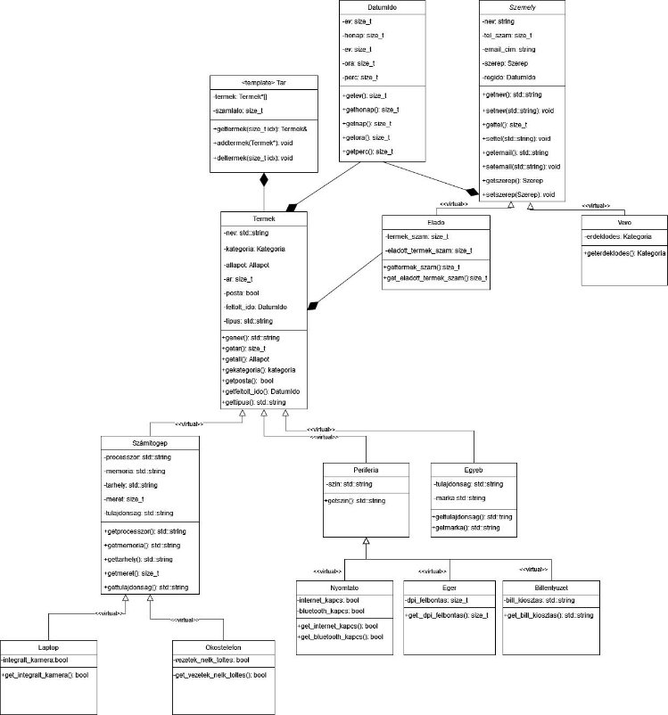

*Szerző: Szautner Béla* 

***Számítástechnikai terméknyilvántartó szoftver*** 

***Dokumentáció*** 

Tartalom 

[***Specifikáció*** ....................................................................................................................................................................... 2 ](#_page0_x33.00_y260.92)[***Terv*** ................................................................................................................................................................................... 3 ](#_page2_x33.00_y48.92)[***Felhasználói útmutató*** ..................................................................................................................................................... 5 ](#_page4_x33.00_y48.92)

*Specifikáció* 

Feladat: 

Számítástechnikai kiskereskedőknek termék nyilvántartó program, amely alapján mind a vásárló, mind a kereskedő számon tudja a tartani a termékek állapotát, elérhetőségeit, részleteit. 

Magvalósítás, paraméterek: 

A program egyszerű és felhasználóbarát felépítésű. Könnyen kezelhető menürendszerrel, amelyben a kiválasztható menüpontok: 

- Bejelentkezés: 
- Ebben a menüpontban kiválaszthatja a felhasználó, hogy eladóként, vagy vevőként szeretné a továbbiakban használni az alkalmazást 

A továbbiakban a bejelentkezési paraméterek alapján módosulnak a menüpontok a különböző típusú felhasználóknak. 

Eladóként: 

- A menüpontok között szerepel az Új termék hozzáadása, Saját termékek listázása, Termék törlése, Termék módosítása, Kilépés. 

Vevőként: 

- A menüpontok között megjelennek a Termékek keresése, Termékekre megadott paraméter alapján szűrés, Kilépés. 

Az applikációban szerepelnek a termékek paraméterei, amelyeket az eladó köteles megadni, hogy a vevő esetlegesen ezek alapján is tudjon szűrni/keresni.  

Specifikáció: használt/új termék, termék típusa, termék márkája, termék jellemzői, esetleg összetétele, megbízhatósága, amely egy 1-5 közötti értéket jelent, különleges jellemzői, kinek ajánlják a terméket. 

- Ár/ térítési díj 
- Termék állapota: használt, használt és garanciális, új 
- Feladás dátuma 

A szoftver külső adatbázisként használt szövegfájlban tárolja a különböző termékek részleteit, adatait, így menthető az aktuálisan frissített nyilvántartás. Ebből az adatbázisfájlból az applikáció a következő indításkor betölti a szereplő termékeket, és ismét jogosult a felhasználó használni a programot. 

*Terv *

***A szoftver főbb algoritmusai:*** 

Tár feltöltési algoritmus: A heterogén tároló amely a megadott eladó(felhasználó)- hoz kapcsolódik egy beágyazott rendezőalgoritmus alapján adja hozzá a megadott pointer alapú Terméket az a listájához. Ez a rendezőalgoritmus DatumIdo szerint rendezi a hozzáadni kívánt Terméket. Belső működése indexeltolás alapú. 

Keresési algoritmus: A keresett Terméket amelyet név azonosít az algoritmus lineáris keresés folytán valósítja meg. 

Szűrési algoritmus: Az adott paraméterre szűrést megvalósító algoritmus szintén a kereséshez hasonlóan a megadott szűrési paraméter alapján lineáris kereséssel teszi lehetővé az Termék/Termékek gyors találatát. 

A szövegfájlból beolvasás algoritmus: A szövegfájlból (adatbázis) beolvasás először a felhasználókat olvassa be, amelyek a szövegfájl elején találhatóak, majd ezek után a Termékeket, amelyeket egyből a megadott eladóhoz kapcsol. 

A szövegfájlba kiírás analóg módon történik a szövegfájlba való beírással, először a felhasználók majd ezek után a feljegyzett Termékek kerülnek kiírásra. 

*Felhasználói útmutató* 

Számítástechnikai terméknyilvántartó program segítségével könnyebben és gyorsabban egymásra találnak a vevő és az eladó fél, ezáltal több termék talál új gazdára rövid időn belül. A szoftverben a bevitelnél a szóköz helyett „\_” (alsóvonalat) kell használni. 

Az  alkalmazás  megnyitása  után  a  következő  menü  jelenik  meg  a  felhasználó előtt a console interfészen:  

Itt a felhasználó a menüpont számának beírásával ki tudja választani,  hogy a „Regisztráció”, „Belépés” vagy „Kilépés” menüpontot szeretné  a továbbiakban használni.  

- Az 1. „Regisztráció” menüpont választása után a  felhasználónak meg kell adnia nevét, ezek után  jelszavát,  telefonszámát,  ami  a  06  utáni  számjegyekből állhat, majd email címét, és hogy  eladóként vagy vevőként szándékozik használni  az alkalmazást. Ha az adott felhasználónév már szerepel a nyilvántartásban, akkor ezt a program jelzi. A  sikeres  regisztrálást  a  program  jelzi  a  használója  felé.  Sikertelenség  esetén  újra  próbálkozhat.  A regisztrációs idő automatikusan mentésre kerül.
- a 2. „Belepes” menüpontot választva a console interfészen  meg kell adni a regisztrációkor használt nevet, és az ahhoz  tartozó  jelszót.  Ha  sikeres  a  belépés,  A  program  jelzi  a  felhasználónak. Sikertelenség esetén újra próbálkozhat.  
- A „Belepes” menüpontot követően, ha a felhasználó  
- Eladóként  lépett  be  akkor  meg  kell  adnia  a  megfelelő  menüpont  kiválasztásával  a  továbbiakban szándékozott műveletet. Itt tud  választani az „Uj termek feltöltese”, „Termekek  listazasa”,  „Termek  torlese”,  „Adatok  modositasa” közül. 
- „Uj termek feltoltese” menüpont: Itt a felhasználó a console interfészen megjelent kérésekre a megfelelő választ adva egy terméket tud hozzáadni a saját termékeit tartalmazó listához. 
- „Termekek listazasa” menüpont: Kiválasztásával az összes eddig feltöltött és azóta nem törölt termékek jelennek meg. 
- „Termek torlese” menüpont: A menüpont kiválasztása majd az adott sorszámú termék előtti  számjegy  bevitelével  ki  lehet  választani,  hogy  melyik  terméket  szeretné eltávolítani a listából. A törlés után a termék visszaállítása nem lehetséges. 
- „Adatok  módosítása”  menüpont:  Ez  a  menüpont  mindkét  típusú  felhasználónál ugyanolyan.  A  megfelelő  sorszámú  menüpont  után  lehetőség  van  az  eddigi kiválasztott adat felülírására, amely lehet a név, jelszó, telefonszám, email-cím. Az eladó és vevő típus módosítására nincs lehetőség. 
- Vevőként  pedig  az  alábbiak  közül  tud  választani:  „Termek  keresese”,  „Elado  keresese”, „Adatok modositasa”.  
- „Termek  keresese”  menüpont:  Itt  a  felhasználó  ki  tudja  választani,  hogy  milyen típúsú termékeket szeretne megtekinteni az adataival együtt amelyek a név, ár hírdető neve, és elérhetősége. A következő típusú termékekre lehet szűrni: pc, laptop, okostelefon, nyomtató, egér, billentyűzet, más eszköz. 
- „Elado keresese” menüpont: Itt a megfelelő név megadásával megjelenik az adott eladó elérhatőségei, neve, és a hozzá rendelt termékek száma. 
- „Adatok  módosítása”  menüpont:  ugyanolyan,  mint  az  eladónál  bemutatott  menü felépítése. 

Mindkét  felhasználótípus  (eladó/vevő),  az  utolsó  menüpontjának  segítségével  ki  tud  lépni  a főmenübe. 

Az applikáció a főmenüből való program által támogatott („Kilépés menüpont”) kilépés után elmentésre kerülnek az adatok egy külső adatbázisként használt .txt kiterjesztésű szövegfájlban. A program újboli megnyitása során ezek az adatok hiánytalanul betöltődnek, így a felhasználók az applikációt úgy tudják használni ismét, mintha le sem állították volna. 
6 
